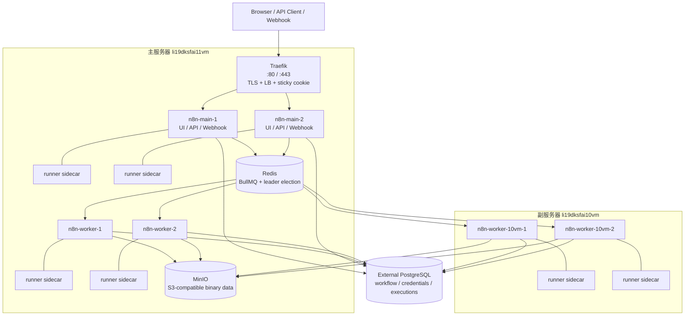
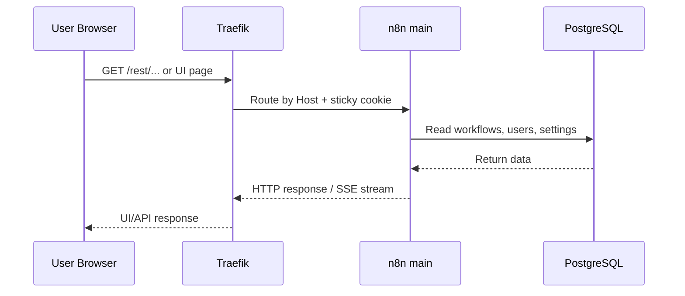
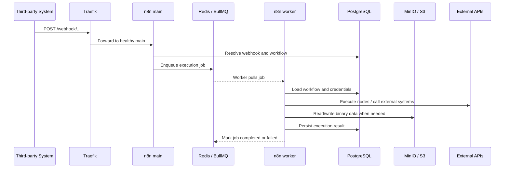
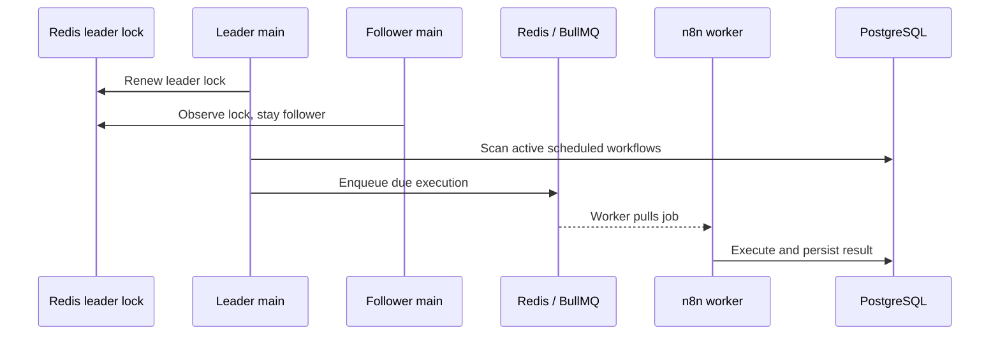
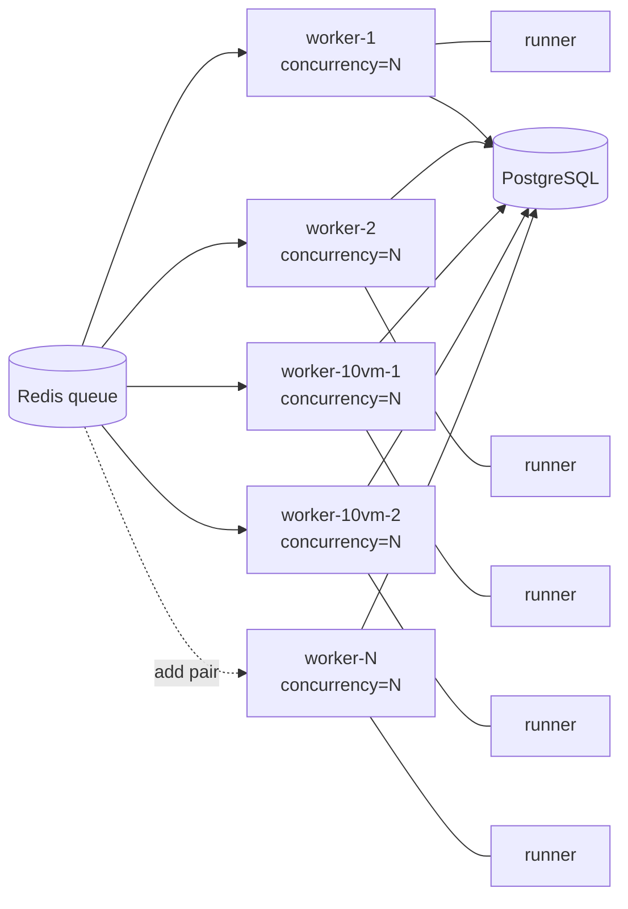
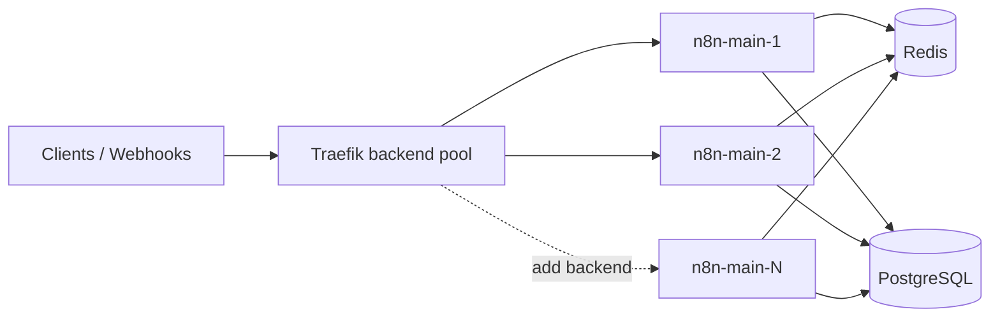
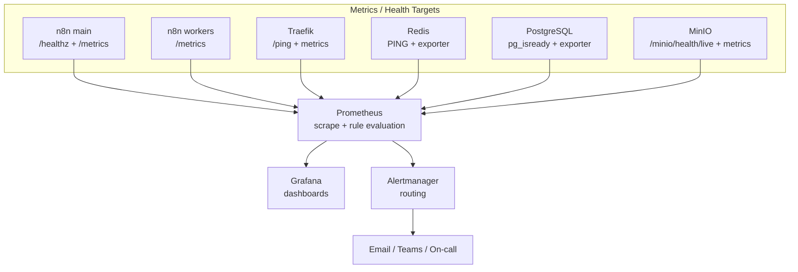

# n8n 部署方案内部分享稿

> 面向团队分享会使用。本文以当前仓库中的 `docker-compose.yml`、`docker-compose.worker.yml`、`.env.example` 和 Traefik 配置为准，重点解释方案为什么这样设计、各组件承担什么职责、如何扩展，以及上线后还需要补齐哪些监控能力。

## 1. 一句话概览

本方案是一个基于 Docker Compose 的 n8n 企业版高可用执行集群：

- 主服务器 `li19dksfai11vm.bmwgroup.net` 承担统一入口、n8n main、Redis 队列、MinIO 二进制存储和本机 worker。
- 副服务器 `li19dksfai10vm.bmwgroup.net` 只部署 worker 和 task runner，用于扩展执行吞吐。
- PostgreSQL 使用外部数据库，作为工作流、凭据、用户、执行记录的共享事实源。
- Redis 同时承担 BullMQ 队列和 multi-main leader election 依赖。
- MinIO 提供 S3-compatible binary data 存储，避免多实例场景下文件散落在本地磁盘。

参考资料：

- n8n 官方 Queue Mode: <https://docs.n8n.io/deploy/host-n8n/configure-n8n/scaling/enable-queue-mode.md>
- n8n 官方 Task Runners: <https://docs.n8n.io/deploy/host-n8n/configure-n8n/set-up-task-runners.md>
- n8n 官方 Prometheus Metrics: <https://docs.n8n.io/deploy/host-n8n/configure-n8n/basic-configuration/configuration-examples/enable-prometheus-metrics.md>
- n8n 官方 External Storage: <https://docs.n8n.io/deploy/host-n8n/configure-n8n/scaling/use-external-storage.md>

## 2. 当前部署拓扑



当前服务分布：

| 位置 | 服务 | 作用 |
|------|------|------|
| 主服务器 | Traefik | 统一入口、TLS 终结、main 实例负载均衡、健康检查 |
| 主服务器 | n8n-main-1 / n8n-main-2 | UI、REST API、webhook 接入、任务入队、leader/follower 切换 |
| 主服务器 | Redis | BullMQ 队列、multi-main leader election、跨服务器 worker 调度 |
| 主服务器 | MinIO | S3-compatible binary data 存储 |
| 主服务器 | n8n-worker-1 / n8n-worker-2 | 从 Redis 拉取任务并执行 |
| 副服务器 | n8n-worker-10vm-1 / n8n-worker-10vm-2 | 扩展执行能力，不承接入口流量 |
| 所有 n8n 实例旁 | `n8nio/runners` sidecar | 外部 task runner，用于 Code 节点隔离执行 |
| 外部服务 | PostgreSQL | 工作流、凭据、用户、执行历史、配置的共享数据库 |

## 3. n8n 本身架构

### 3.1 Main 进程

Main 进程是 n8n 的控制面和入口层，当前部署了两个实例。

主要职责：

- 提供 Web UI 和 REST API。
- 接收 webhook 请求。
- 将 workflow execution 转换成队列任务并写入 Redis。
- 在 multi-main 场景中参与 leader election。
- 处理定时触发、轮询类触发等需要全局唯一调度的任务。

这里的关键点是：main 不应该承担主要执行压力。`OFFLOAD_MANUAL_EXECUTIONS_TO_WORKERS=true` 已配置，目标是把手动执行也尽量交给 worker，减少 main 被长任务拖慢的概率。

### 3.2 Worker 进程

Worker 是执行面。它不对外提供 UI，也不接收普通用户请求，只从 Redis 队列拉取待执行任务。

主要职责：

- 消费 Redis BullMQ 队列中的 execution job。
- 从 PostgreSQL 读取 workflow、credentials、execution metadata。
- 执行节点链路，包括 HTTP 请求、数据转换、第三方系统调用等。
- 将执行状态、执行结果写回 PostgreSQL。
- 按需读写 MinIO/S3 中的 binary data。

扩展吞吐时优先增加 worker 数量，而不是增加 main 数量。原因是大部分 CPU、内存和外部 I/O 压力都发生在 workflow execution 阶段。

### 3.3 Task Runner

Task runner 是 Code 节点的隔离执行进程。当前方案为每个 main/worker 都配套一个 `n8nio/runners` sidecar，并使用：

```env
N8N_RUNNERS_ENABLED=true
N8N_RUNNERS_MODE=external
N8N_RUNNERS_AUTH_TOKEN=<shared-token>
N8N_RUNNERS_BROKER_LISTEN_ADDRESS=0.0.0.0
```

外部模式的价值：

- Code 节点不直接跑在 n8n 主进程内，降低安全和稳定性风险。
- task runner 崩溃时影响范围更小。
- 方便后续单独限制 runner 的 CPU、内存、依赖包和网络权限。

注意：runner 镜像版本要和 n8n 镜像版本保持一致，当前通过 `N8N_VERSION=2.26.8` 统一控制。

## 4. 周边服务

### 4.1 Traefik

Traefik 是唯一对用户开放的入口。

当前职责：

- 监听 `80` / `443`。
- HTTP 自动跳转 HTTPS。
- 根据 Host 路由到 `n8n-main-1` / `n8n-main-2`。
- 使用 `/healthz` 做 main 健康检查。
- 使用 sticky cookie `n8n_sid` 保持 UI 长连接、SSE 等会话稳定。

Traefik 只代理 main，不代理 worker。worker 是内部执行节点，不应该暴露给用户或第三方 webhook。

### 4.2 PostgreSQL

PostgreSQL 是最重要的持久化组件，本部署不在 compose 中管理，而是外部提供。

保存内容包括：

- workflow 定义。
- credentials，加密后存储。
- users、projects、roles 等权限数据。
- execution metadata 和 execution data。
- n8n settings 和 license 相关状态。

所有 main/worker 必须连接同一个 PostgreSQL，并共享同一个 `N8N_ENCRYPTION_KEY`。否则会出现某个实例创建的凭据在另一个实例无法解密的问题。

### 4.3 Redis

Redis 在本方案中不是普通缓存，而是关键运行依赖。

当前职责：

- BullMQ 队列：main 入队，worker 出队。
- leader election：多个 main 中只有 leader 处理全局唯一任务。
- 队列健康检查：`QUEUE_HEALTH_CHECK_ACTIVE=true`。

这意味着 Redis 故障会直接影响任务调度。当前 Redis 是主服务器单实例，已开启密码和持久化配置，但还不是 Redis Sentinel 或 Redis Cluster。

### 4.4 MinIO / S3

MinIO 提供 S3-compatible binary data storage。

为什么需要它：

- Queue Mode 下官方不支持 filesystem binary data 作为共享存储。
- main/worker 可能分布在不同服务器，本地文件系统无法天然共享。
- 工作流处理文件、图片、PDF、附件时，需要一个所有实例都能访问的对象存储。

当前主服务器使用 `http://minio:9000`，副服务器 worker 需要使用主服务器地址，例如 `http://li19dksfai11vm.bmwgroup.net:9000`。

注意：n8n external storage 是企业版能力，license 未满足时要重点验证写入行为。

## 5. 核心请求链路

### 5.1 UI / API 请求



这个链路主要由 main 承担。sticky session 用于减少长连接和执行状态推送中断。

### 5.2 Webhook 执行



这里的关键点是 webhook 接收和 workflow 执行分离：main 只负责接入和入队，worker 负责真正执行。

### 5.3 定时任务



只有 leader main 处理全局唯一触发，避免两个 main 同时触发同一个 cron workflow。

## 6. 扩展方案

### 6.1 横向扩展 worker

最直接的扩展方式是增加 worker + runner 成对实例。



适用场景：

- Redis 队列等待任务持续增长。
- worker CPU 使用率持续偏高。
- 工作流平均执行时长变长。
- webhook 入队很快，但执行完成变慢。

当前已有两种扩展路径：

- 主服务器通过复制 `n8n-worker-N` 和 `n8n-worker-N-runner` 服务扩容。
- 副服务器通过 `docker-compose.worker.yml` 增加更多 worker/runner 对。

估算方式：

```text
总并发 = worker 数量 x N8N_WORKER_CONCURRENCY
理论吞吐 = 总并发 / 平均工作流执行时长
```

不要只靠调大 `N8N_WORKER_CONCURRENCY`。如果 workflow 是 CPU 密集型，过高并发会导致单容器争抢 CPU；如果是 I/O 密集型，可以适度提高并发，但仍需要监控内存和外部 API 限流。

### 6.2 扩展 main

增加 main 的主要收益是提升入口层可用性和 UI/API/webhook 接收能力，不是提升执行能力。



适用场景：

- webhook 接入请求量很高。
- UI/API 请求量明显增加。
- 需要更多入口实例做故障隔离。

扩展 main 时要同步修改：

- Traefik dynamic servers 列表。
- main 对应的 runner sidecar。
- 共享 `N8N_ENCRYPTION_KEY`、Redis、PostgreSQL、S3 配置。

### 6.3 存储层扩展

当前存储层仍有单点：

- PostgreSQL 外部提供，但本仓库不定义 HA。
- Redis 是主服务器单实例。
- MinIO 是主服务器单实例。

后续生产增强建议：

| 组件 | 当前状态 | 演进方向 |
|------|----------|----------|
| PostgreSQL | 外部单连接配置 | 托管 RDS / Patroni / 企业数据库 HA |
| Redis | 单实例 | Redis Sentinel 或托管 Redis HA |
| MinIO | 单实例 | MinIO Distributed Mode 或企业对象存储 |
| Traefik | 主服务器单入口 | 外部 LB / VIP / DNS failover |

### 6.4 安全扩展

建议后续补齐：

- Redis 和 MinIO 仅允许内网访问，避免公网暴露。
- `.env` 改为密钥管理系统或部署平台 secret。
- runner 容器限制允许导入的 Node/Python 模块。
- 对 `/metrics`、Traefik Dashboard、MinIO Console 加访问控制。
- 对外 webhook 域名统一收敛到 HTTPS。

## 7. 监控服务待实现

当前 compose 中还没有 Prometheus / Grafana / Alertmanager 服务。n8n 官方 `/metrics` 端点默认关闭，需要显式设置：

```env
N8N_METRICS=true
N8N_METRICS_INCLUDE_QUEUE_METRICS=true
```

现有 worker healthcheck 已经访问 `/metrics`，但 `.env.example` 还没有显式配置 `N8N_METRICS=true`。实现监控时应同步补齐环境变量，避免健康检查与实际指标暴露配置不一致。

建议分阶段实现。



### 7.1 第一阶段：基础存活监控

目标：先知道服务是否活着。

需要监控：

- Traefik `/ping`。
- n8n main `/healthz`。
- Redis `PING`。
- MinIO `/minio/health/live`。
- PostgreSQL `pg_isready` 或外部数据库监控。
- worker 容器进程状态。

告警建议：

- 任一 main 不健康超过 2 分钟。
- 所有 main 不健康立即告警。
- 任一 worker 不健康超过 5 分钟。
- Redis / PostgreSQL 不可达立即告警。

### 7.2 第二阶段：Prometheus + Grafana

目标：看到执行吞吐和队列积压。

需要新增：

- Prometheus service。
- Grafana service。
- Prometheus scrape 配置。
- Grafana dashboard provisioning。

重点指标：

| 指标类别 | 关注点 |
|----------|--------|
| n8n queue | waiting、active、completed、failed、leader role |
| n8n process | CPU、RSS memory、event loop、进程重启 |
| workflow | 执行次数、失败率、执行耗时 |
| Redis | 内存、连接数、AOF 状态、队列 key 大小 |
| PostgreSQL | 连接数、慢 SQL、锁等待、表膨胀、磁盘 |
| MinIO/S3 | 读写错误、容量、请求延迟 |
| Traefik | 5xx、请求延迟、后端健康状态 |

### 7.3 第三阶段：日志与审计

目标：出现问题时能快速定位到 workflow、节点、实例。

建议：

- Docker logs 汇聚到 Loki / ELK / OpenSearch。
- n8n 日志统一 JSON 化。
- 为 main、worker、runner 添加实例标签。
- 保留 workflow execution ID，方便从日志跳转到 n8n UI。
- 对敏感字段做脱敏，避免 credentials、token、payload 泄漏。

### 7.4 第四阶段：容量与业务 SLO

目标：把监控从“机器活着”提升到“自动化平台可用”。

建议定义：

- webhook 成功接收率。
- workflow 执行成功率。
- P95 / P99 execution duration。
- queue waiting time。
- 关键业务 workflow 单独告警。
- 外部 API 限流、超时、认证失败分类统计。

## 8. 分享时建议强调的设计取舍

### 8.1 为什么用 Queue Mode

Queue Mode 把接入和执行拆开，main 负责控制面，worker 负责执行面。这样可以通过增加 worker 线性扩展执行能力，也能避免长时间 workflow 阻塞 UI/API/webhook 接入。

### 8.2 为什么需要外部 PostgreSQL

n8n 的核心状态都在数据库里。多 main 和多 worker 要看到同一份 workflow、credentials 和 execution data，因此必须使用共享数据库。SQLite 不适合这个场景。

### 8.3 为什么需要 Redis

Redis 是 worker 调度的消息通道，也是 multi-main leader election 的依赖。没有 Redis，queue mode 无法工作，worker 不知道该执行哪些任务。

### 8.4 为什么需要 MinIO/S3

多实例场景不能依赖本地 filesystem 保存 binary data。否则 worker A 产生的文件，worker B 或 main 可能读不到。对象存储是跨实例共享 binary data 的稳定方式。

### 8.5 为什么每个 n8n 实例旁边都有 runner

Code 节点需要 task runner 执行。官方生产建议使用 external mode，并且 queue mode 下每个 worker 需要自己的 sidecar。这样可以把用户代码执行和 n8n 主进程隔离开。

## 9. 可能会被问到的问题

### Q1: 这个方案是不是完全高可用？

不是。n8n main 和 worker 层做了冗余，但 Redis、MinIO、Traefik 入口和外部 PostgreSQL 的 HA 不由当前 compose 完整解决。准确说，本方案是“n8n 执行层可横向扩展 + main 层冗余”的部署方案，存储层和入口层 HA 需要后续补齐。

### Q2: main 挂了一台会怎样？

Traefik 会通过 `/healthz` 把不健康 main 从后端池剔除，请求转发到另一台 main。如果挂掉的是 leader，另一个 main 会通过 Redis 选举接管全局唯一任务。短时间内定时任务可能延迟，但不应该长期中断。

### Q3: worker 挂了会怎样？

worker 是无状态执行节点。容器重启后会重新加入消费；未完成任务会依赖队列机制被其他 worker 接手或重试。需要注意的是 workflow 本身要尽量设计成幂等，避免外部系统重复写入。

### Q4: 为什么副服务器只放 worker，不放 main？

当前目标是优先扩展执行吞吐。worker 增加后能直接提升 workflow execution 能力。副服务器后续也可以放 main，但需要把它加入 Traefik 后端，并确保网络、证书、健康检查、runner 都配置完整。

### Q5: 能不能只提高 worker concurrency，不增加 worker？

可以小幅提高，但不是无限制。并发过高会带来 CPU、内存、数据库连接、外部 API 限流压力。更稳妥的方式是结合监控判断：I/O 密集型可以提高并发，CPU 密集型优先增加 worker 实例。

### Q6: Redis 为什么不能当普通缓存看待？

因为 Redis 承载执行队列和 leader election。它故障时，新的任务无法正常入队/出队，multi-main 的 leader 状态也会受影响。因此 Redis 需要持久化、访问控制和后续 HA 方案。

### Q7: PostgreSQL 里保存 credentials，会不会不安全？

credentials 是加密存储的，关键在 `N8N_ENCRYPTION_KEY`。所有实例必须使用同一个 key；同时这个 key 必须安全保存。如果 key 丢失，历史 credentials 可能无法解密；如果 key 泄漏，数据库泄漏风险会显著放大。

### Q8: MinIO 挂了会影响所有 workflow 吗？

只影响需要读写 binary data 的 workflow，例如文件、图片、PDF、附件处理。纯 JSON/HTTP API 类型 workflow 可能不受影响。但如果默认 binary data mode 是 S3，MinIO 故障会导致相关执行失败，需要监控和告警。

### Q9: 监控为什么没有现在就放进 compose？

当前仓库重点先跑通 n8n HA 执行链路。监控需要额外设计指标暴露、内部访问控制、数据持久化和告警策略。直接把 Prometheus/Grafana 放进去但不配置告警和安全边界，价值有限，也可能暴露敏感运行数据。

### Q10: Webhook URL 为什么必须指向 Traefik？

因为外部系统应该只感知统一入口，而不是某个 main 实例。`WEBHOOK_URL` 指向 Traefik 后，main 故障、实例扩缩容、证书更新都可以在入口层处理，外部 webhook 配置不需要变。

### Q11: 这个方案可以迁移到 Kubernetes 吗？

可以。组件边界已经比较清晰：main、worker、runner、Redis、MinIO、Traefik 都能映射成 Deployment/StatefulSet/Service/Ingress。迁移重点是 secret 管理、持久卷、探针、HPA、PodDisruptionBudget 和外部数据库连接。

### Q12: 后续上线前最需要补什么？

优先级建议：

1. Prometheus/Grafana/Alertmanager。
2. Redis HA 或托管 Redis。
3. MinIO HA 或企业对象存储。
4. 入口层 HA。
5. 日志集中化和关键 workflow SLO。

## 10. 分享结尾建议

可以用这句话收束：

> 本方案的核心不是“把 n8n 多起几个容器”，而是把 n8n 拆成入口控制面、队列调度层、执行层和共享存储层。这样我们可以独立扩展 worker，应对执行压力；用 multi-main 降低入口单点；用 PostgreSQL、Redis、S3 保证多实例之间看到同一份状态。下一步要补齐的是存储层 HA、监控告警和日志审计。
